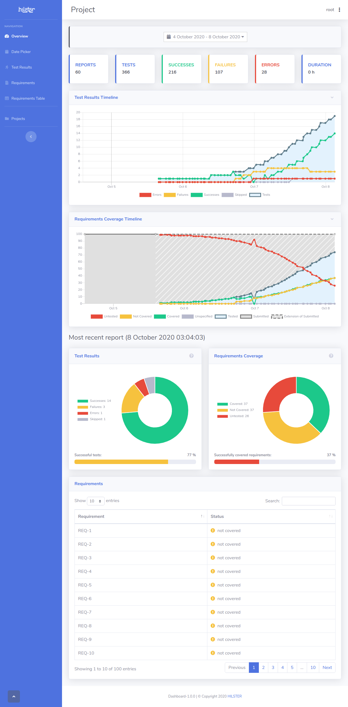

# Dashboard

The HILSTER Dashboard is an interactive analytics and test-management tool for test results during development.
It measures test results and requirements coverage and generates expressive charts.

Fully integrated into the [HILSTER TestBench](https://docs.hilster.io/htf/latest/),
test reports can be sent automatically to the Dashboard upon conclusion of a test run.

Additionally, JUnit-XML compatible reports generated by other testing suites can also be uploaded to allow for a
comprehensive overview of the project's current test status.

It is possible to measure requirements coverage over different test levels and different tools
with the Dashboard.

It serves users in both managing and developing roles, showing the current project status as well as changes over time.

Project requirements can be supplied to the Dashboard enabling users to see whether requirements are already
covered by tests.

For more information read the see
[full Dashboard documentation](https://docs.hilster.io/dashboard/latest/) or checkout the
[video](videos/dashboard_overview.mp4).

# Deployment

See [Dashboard documentation](https://docs.hilster.io/dashboard/latest/deployment.html).
